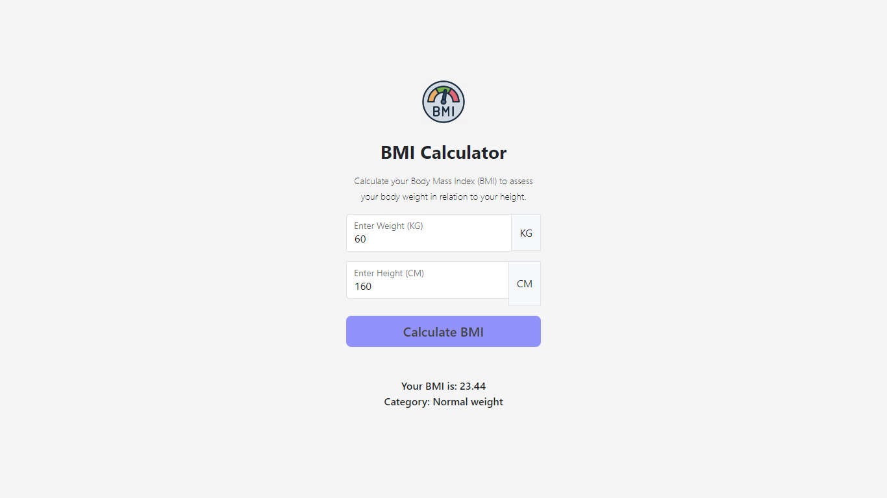

# BMI Calculator


## Overview

This BMI (Body Mass Index) Calculator is a web application that allows users to calculate their BMI based on their weight (in KG) and height (in CM). The BMI is a measure of body fat based on an individual's weight and height.

## Usage

1. Open the [BMI Calculator](#) in your web browser.
2. Enter your weight in kilograms (KG) and your height in centimeters (CM).
3. Click the "Calculate BMI" button to see your BMI result and category.

## Screenshots



## Technologies Used

- HTML
- CSS (Bootstrap 5)
- JavaScript

## Setup

1. Clone the repository:

    ```bash
    git clone https://github.com/diandrarad/BMI-Calculator.git
    ```

2. Open the `index.html` file in your web browser.

## Credits

This BMI Calculator project was created as part of the Technical Project Assignment for the Web Development Basic Stage at Skilvul.

## License

This project is licensed under the [MIT License](LICENSE).
